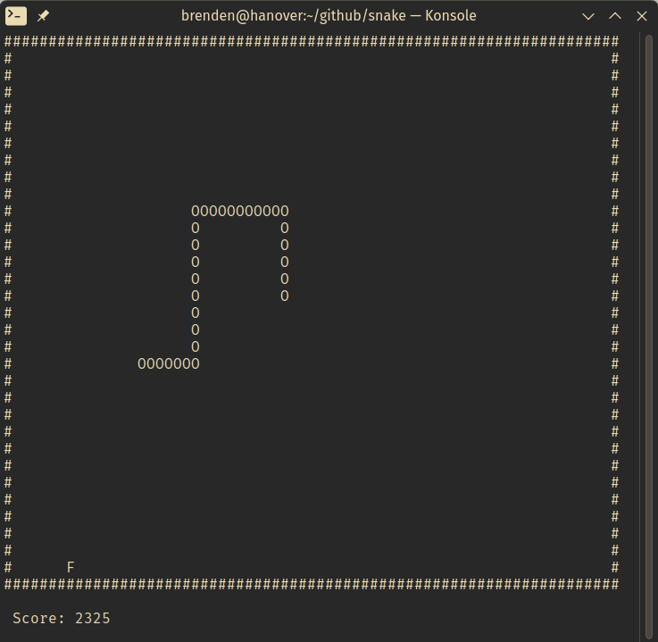

# snake

A simple Snake game written in C which runs in the terminal using the ncurses library for Linux. Use WASD or arrow keys to control the direction of the snake. The playable area scales with terminal size.

### Screenshot



## How to run

Compile the program using `make`:

```
make
```

Run the `snake` executable:

```
./snake
```

## Dependencies:

This project uses the `ncurses` library.

Install on Debian/Ubuntu:

```
sudo apt-get install libncurses-dev
```

Install on Fedora:

```
sudo dnf install ncurses-devel
```

Install on Arch:

```
sudo pacman -S ncurses
```
